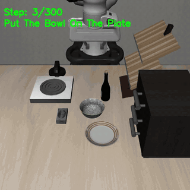
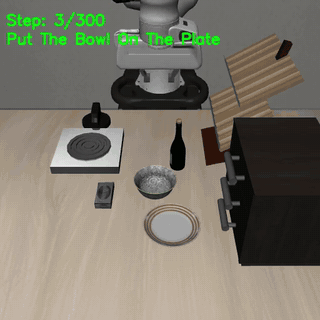
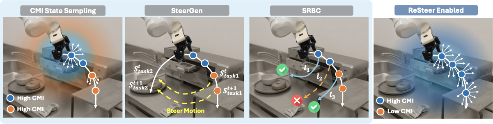

<p align="center">
  <picture>
    <source media="(prefers-color-scheme: dark)" srcset="docs/assets/resteer_logo_dark.png">
    
  </picture>
</p>

<h1 align="center">ReSteer</h1>

<p align="center"><b>Quantifying and Refining the Steerability of Multitask Robot Policies</b><br>Robotics: Science and Systems (RSS) 2026</p>

<p align="center">
  <a href="https://chenzheny.github.io">Zhenyang Chen</a>,
  <a href="https://alantian2018.github.io/">Alan Tian</a><sup>†</sup>,
  <a href="https://lichothu.github.io">Liquan Wang</a><sup>†</sup>,
  <a href="https://sites.cc.gatech.edu/~bjoffe3">Benjamin Joffe</a>,
  <a href="https://eiclab.scs.gatech.edu">Yingyan Celine Lin</a>,
  Yuxiao Chen,
  <a href="https://www.siddkaramcheti.com">Siddharth Karamcheti</a><sup>‡</sup>,
  <a href="https://faculty.cc.gatech.edu/~danfei">Danfei Xu</a><sup>‡</sup><br>
  Georgia Institute of Technology<br>
  <sup>†</sup>Equal contribution &nbsp; <sup>‡</sup>Equal advising
</p>

<p align="center">
  <a href="https://resteer-vla.github.io"></a>
  <a href="https://arxiv.org/abs/2603.17300"></a>
  <a href="https://resteer-vla.github.io/static/papers/ReSteer_RSS2026.pdf"></a>
  <a href="LICENSE"></a>
</p>

A multitask robot policy is **steerable** if it follows a new instruction given at any point during execution, not
only at the start. ReSteer measures steerability, finds the states where a policy ignores language, and generates
the data that fixes it. This repository contains the complete LIBERO pipeline of the paper.

<table align="center">
  <tr>
    <td align="center" width="50%"></td>
    <td align="center" width="50%"></td>
  </tr>
  <tr>
    <td align="center">π<sub>0.5</sub> keeps carrying the bowl</td>
    <td align="center">ReSteer switches to the wine bottle</td>
  </tr>
</table>

<p align="center"><sub>Both policies start on <i>put the bowl on the plate</i>. Partway through, the instruction changes to <i>put the wine bottle on top of the cabinet</i>.</sub></p>

## How ReSteer works

<p align="center"></p>

1. **Find where language is ignored.** Conditional mutual information `I(A;L|s)` between instruction and action
   flags states where changing the instruction barely changes the action, without running any rollouts.
2. **Generate steering data (SteerGen).** Bridge the end effector from a state of task A to a stage-consistent
   state of task B, labelled with B's instruction.
3. **Refine on the policy's own switches (SRBC).** Roll out task switches at the weak points, keep the successful
   ones, and fine-tune on them.

| Component | What it does | Code |
|---|---|---|
| **Steerability evaluation** | Switch the instruction mid-rollout, from every task to every other task at 20 switch steps, and measure switched-task success | `resteer/eval` |
| **CMI proxy** | Estimate `I(A;L\|s)` at a state from policy samples, and select low-CMI switching points | `resteer/cmi` |
| **SteerGen** | Stage-aware steering segments between tasks, generated from demonstrations | `resteer/steergen` |
| **SRBC** | Collect successful task switches at low-CMI or low-success switching points | `resteer/srbc` |
| **Training** | Co-train π0.5 on LIBERO plus generated data with upstream [openpi](https://github.com/Physical-Intelligence/openpi) | `policy/` |

## Results with this release

The full pipeline, rerun with this code on one 8×H100 node: data generation, fine-tuning, and evaluation with
20,000 rollouts per policy.

| Policy | Steerability | Paper | CMI | Paper |
|---|---|---|---|---|
| π0.5 (released `pi05_libero`) | 0.404 | 0.403 | 0.204 | 0.217 |
| + SteerGen | 0.604 | 0.49 | 0.309 | 0.31 |
| + SteerGen + SRBC (ReSteer) | **0.629** | 0.51 | 0.310 | 0.30 |

- **Steerability** is averaged over all target instructions, including the source task's own, as in the paper.
  Over target ≠ source only, the scores are 0.340, 0.573 and 0.596.
- **CMI** is normalized and uses Title Case instructions, as in the paper's runs.
- **SteerGen and ReSteer score higher than in the paper.** This release labels generated data with the lower-case
  instructions the policy is evaluated with. With the paper-era Title Case labels, SteerGen scores 0.477.

Per-switch-step curves, per-task tables, data statistics and timings are in
[docs/replication.md](docs/replication.md).

## How the pieces fit

```
 simulation side (Python 3.10)                        policy side (Python 3.11, upstream openpi)
 ┌───────────────────────────────┐   websocket    ┌──────────────────────────────────────────┐
 │ resteer: LIBERO + evaluation, │ ─────────────▶ │ openpi policy server (unmodified)        │
 │ CMI, SteerGen, SRBC           │ ◀───────────── │   any pi0/pi0.5 checkpoint               │
 └──────────────┬────────────────┘  obs → actions └──────────────────────────────────────────┘
                │ episode HDF5 (docs/interfaces.md)                ▲ checkpoints
                ▼                                                 │
        policy/resteer_policy: convert_to_lerobot → LeRobot → train (openpi) → export_checkpoint
```

- The two sides share no code, only a websocket protocol and file formats.
- Any policy served over openpi's websocket protocol can be evaluated.
- `third_party/openpi` is upstream openpi pinned as a git submodule and **not modified**. ReSteer's training
  additions (weighted multi-dataset co-training and configs) live in `policy/resteer_policy`.
- `third_party/libero` is a modified LIBERO. Use it as is: it changes success checks; see
  [its change log](third_party/libero/RESTEER_CHANGES.md).

## Installation

Requirements:
- Linux with an NVIDIA GPU. Policy serving needs about 10 GB of GPU memory, and MuJoCo renders with EGL.
- A C compiler, libGL, libEGL and GLib. On Ubuntu: `sudo apt-get install -y build-essential libgl1 libegl1 libglib2.0-0`.
- [uv](https://docs.astral.sh/uv/).

```bash
git clone --recurse-submodules https://github.com/ChenZhenY/ReSteer.git && cd ReSteer
scripts/setup_env.sh      # both uv environments + a rendering check
```

It runs `uv sync` twice:
- at the repo root: simulation, Python 3.10;
- in `third_party/openpi`: policy, Python 3.11, JAX (with `GIT_LFS_SKIP_SMUDGE=1`).

It then renders one frame of the steerability scene. If rendering fails, check `MUJOCO_GL=egl` and that the NVIDIA
EGL libraries are visible. In containers, set `NVIDIA_DRIVER_CAPABILITIES=all`.

## Quickstart: steerability of the released π0.5 LIBERO policy

```bash
scripts/eval_steerability.sh --quick --out results/smoke          # ~40 rollouts, a few minutes
scripts/eval_steerability.sh --gpus 0,1 --out results/pi05_libero  # full protocol: 20k rollouts
scripts/eval_steerability.sh --checkpoint /path/to/ckpt --out results/my_policy
```

The script:
1. starts policy servers (two per GPU by default);
2. runs one evaluation worker per source task;
3. aggregates the results with `python -m resteer.eval.score`.

`results/<name>/summary.json` holds the score, the per-task scores and the full success matrices (`--plot` draws
them). Re-running the same command resumes an interrupted evaluation, with results identical to an uninterrupted run.

**Protocol** (details and the rationale for each constant: [docs/protocol.md](docs/protocol.md)):
1. Each rollout starts from a random scene and warms up for 10 zero-action steps.
2. The policy follows the source task's instruction. At step `k` ∈ {0, 5, …, 95} it receives the target task's
   instruction.
3. The rollout succeeds if the target goal holds within 300 steps, after step `k`.
4. **Steerability score** = mean success over all (source, target ≠ source, k) cells, with 10 rollouts per cell:
   10·9·20·10 = 18,000 rollouts.

The run also executes target = source (10% extra rollouts), so the summary also reports the mean including those
cells. That is the number the paper-era scripts printed and the paper reports.

<details>
<summary><b>Policy servers and scaling to many GPUs</b></summary>

- **Servers.** By default the launchers serve with `policy/resteer_policy/serve_batched.py`. It uses openpi's own
  policy and transforms, but runs requests from concurrent workers through the model together. It gives the same
  action distribution as openpi's stock `scripts/serve_policy.py` at several times the throughput. `--server openpi`
  uses the stock server instead.
- **More workers.** `--workers-per-task N` splits each task's switch steps over N workers. Each (task, switch step) is
  then seeded independently: statistically the same protocol, but with other object layouts than the paper-exact
  default.
- **Rendering GPUs.** `--render-gpus` puts MuJoCo rendering on GPUs of its own. Data-center GPUs such as the H100 have
  little graphics hardware, so rendering, not inference, often limits throughput. We used up to 20 workers per GPU.
- **Crashes.** On one 8×H100 node, the NVIDIA EGL driver kept aborting rendering workers on five of the eight GPUs;
  the other three were stable.
  - The launchers restart failed workers (`--max-restarts`, default 3), which resume where they stopped.
  - If a GPU keeps failing, leave it out of `--render-gpus`.
- **Memory.** `SERVER_MEM_FRACTION` (default 0.9) sets how much GPU memory the policy servers preallocate. Lower it
  when rendering shares their GPUs.

</details>

<details>
<summary><b>Running the evaluation by hand</b></summary>

With any policy server that speaks the openpi websocket protocol:

```bash
scripts/serve_policy.sh --checkpoint gs://openpi-assets/checkpoints/pi05_libero --port 8000 &   # or your own server
uv run python -m resteer.eval.steerability --out results/pi05 --port 8000 --tasks 0 --num-repeats 2
uv run python -m resteer.eval.score results/pi05
```

</details>

## CMI: an offline proxy for steerability

```bash
scripts/run_cmi.sh --out results/cmi/pi05_libero
```

The script:
1. rolls the policy out on each task and keeps the visited states;
2. at 20 states per task, draws 32 action chunks for each of the 10 instructions;
3. estimates `H(A|s,l)` and `H(A|s)` with a Gaussian KDE over chunk end points;
4. reports `CMI(s,l) = max(0, H(A|s) − H(A|s,l))`, normalized by `H(A|s)` as in the paper.

It writes:
- `cmi_summary.json`: per task, per step and per instruction;
- `low_cmi_tuples.json`: the lowest-CMI switching configurations, used for CMI-guided data generation.

To compare policies, reuse one state set with `--states results/cmi/pi05_libero/states.hdf5`.
Details: [docs/cmi.md](docs/cmi.md).

## Data generation

**SteerGen** (stage-aware steering segments from demonstrations) is described in [docs/steergen.md](docs/steergen.md):

```bash
scripts/download_data.sh                      # LIBERO-Goal demonstrations -> data/states/libero_goal_demos.hdf5
scripts/run_steergen.sh --out data/steergen
```

**SRBC** (successful task-switching rollouts, selected by success rate or by low CMI) is described in
[docs/srbc.md](docs/srbc.md):

```bash
scripts/run_srbc.sh --help
```

Both write episode HDF5 files in the [documented format](docs/interfaces.md). Convert them for openpi with:

```bash
scripts/policy.sh convert_to_lerobot --help
```

## Training

Two steps (details in [docs/training.md](docs/training.md)):
1. **SteerGen:** co-train the released `pi05_libero` on LIBERO + SteerGen data, weights 1:3.
2. **SRBC:** continue on LIBERO + SteerGen + SRBC data, weights 1:3:15.

```bash
scripts/policy.sh train pi05_libero_resteer_steergen --exp-name steergen --fsdp-devices 2 --batch-size 64
scripts/policy.sh train pi05_libero_resteer_srbc --exp-name srbc \
    --weight-loader.params-path checkpoints/pi05_libero_resteer_steergen/steergen/1999/params
```

- **Local runs.** Everything runs on your machine.
  - LIBERO's LeRobot data and the π0.5 base weights download on first use; neither needs an account.
  - Generated datasets are written locally by `convert_to_lerobot`.
  - Weights & Biases logging is off unless you pass `--wandb-enabled`.

  See [docs/training.md](docs/training.md#fine-tuning-on-your-machine).
- **Serving.** Checkpoints are served with the stock `pi05_libero` config
  (`scripts/serve_policy.sh --checkpoint <step dir>`).
- **Release.** `scripts/policy.sh export_checkpoint` strips the optimizer state.
- **Hardware.** π0.5 is fully fine-tuned with FSDP. The paper's runs used 2×H100 (`--fsdp-devices 2 --batch-size 64`)
  or 8×A40 (`--fsdp-devices 8 --batch-size 128`).

## Released artifacts

| Artifact | Link |
|---|---|
| ReSteer π0.5 checkpoints (SteerGen, SRBC) | *coming soon* |
| SteerGen and SRBC LeRobot datasets | *coming soon* |
| Policy-rollout state bank used for CMI | *coming soon* |

## Repository layout

```
resteer/            simulation-side package (eval, cmi, steergen, srbc, states, data/episodes, client)
policy/             resteer_policy: openpi-side training configs, LeRobot conversion, batched server, export
scripts/            end-to-end launchers (bash)
third_party/libero  modified LIBERO (see RESTEER_CHANGES.md)
third_party/openpi  upstream openpi (git submodule, unmodified)
docs/               protocol, CMI, SteerGen, SRBC, training, file formats, provenance, replication
tests/              unit tests (uv run pytest) and a GPU-free check of the launchers
```

## Citation

```bibtex
@misc{chen2026resteerquantifyingrefiningsteerability,
  title={ReSteer: Quantifying and Refining the Steerability of Multitask Robot Policies},
  author={Zhenyang Chen and Alan Tian and Liquan Wang and Benjamin Joffe and Yingyan Celine Lin and Yuxiao Chen and Siddharth Karamcheti and Danfei Xu},
  year={2026},
  eprint={2603.17300},
  archivePrefix={arXiv},
  primaryClass={cs.RO},
  url={https://arxiv.org/abs/2603.17300},
}
```

This code builds on [openpi](https://github.com/Physical-Intelligence/openpi) (Apache-2.0),
[LIBERO](https://github.com/Lifelong-Robot-Learning/LIBERO) (MIT) and data-collection tooling developed with
MimicLabs; see [NOTICE](NOTICE).
